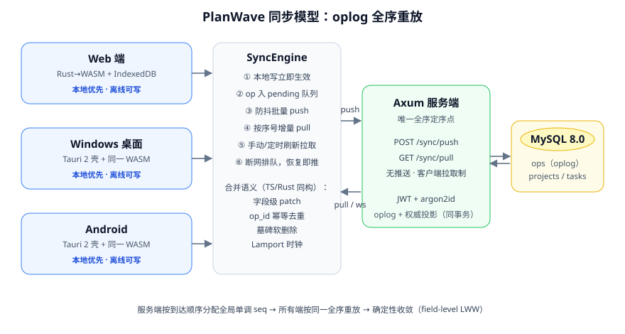

# PlanWave

**离线优先、多端最终一致同步的 To-Do 应用。** 一套 Rust→WASM 数据层 + 一套 React UI 吃遍 **Windows / macOS / Linux / Android / iOS / Web** 六端，自研 oplog 同步协议，Rust 全栈（Tauri 2 + Axum），MySQL 持久化。

<p align="center">
  
</p>

## 特性

- **一套技术吃遍全端**：同步引擎、HTTP 传输、IndexedDB 存储全部用 Rust 编写（wasm-bindgen），编译为 WASM 后在浏览器、Tauri 桌面 WebView、Android/iOS WebView 中运行同一份产物——客户端只有一种存储形态，不存在「桌面 sqlite / 浏览器 IndexedDB」的割裂
- **离线优先**：数据本地完整落库（IndexedDB），断网可增删改，op 进入 pending 队列，恢复后自动推送
- **拉取式同步**：无 WebSocket 推送通道。本地写防抖自动推送；远端变更靠手动刷新按钮 + 自动刷新（启动、窗口聚焦、前台 60s 轮询、推送成功后顺带拉取）保证多端最终一致
- **快照引导 + 增量拉取**：新设备/清库后一次 `GET /sync/snapshot` 拿权威投影，不再全量回放 oplog；pull/snapshot 响应启用 gzip；拉取按「每页一个事务」批量入库，多端首同步显著提速
- **确定性收敛**：自研 oplog 协议，所有端按服务端全序重放，任意时刻任意端重放同一日志必然得到同一状态
- **任务模型**：子任务（单层嵌套，列表缩进 + 详情页管理）与重复任务（完成时自动物化下一次到期实例，支持每 N 天/周/月/年与周几组合）
- **同步过程可观测**：移动端下拉刷新；点击同步徽章打开详情页——pending 队列、最近 op、拉取游标、最近错误一目了然
- **单用户极简鉴权**：JWT（access 15min + refresh 轮换）+ argon2id，服务公网可用而不引入多租户复杂度
- **HeroUI v3 UI**：React Aria Components + Tailwind v4，Things 3 风格三栏布局、深色模式、回收站、标签、优先级、搜索、到期本地通知

## 仓库结构

> 逐文件讲解与「一次任务修改的完整旅程」见 [docs/CODE_TOUR.md](docs/CODE_TOUR.md)（源码导览）。

```
PlanWave/
├── apps/
│   ├── web/          # 唯一前端：React 19 + HeroUI v3 + Tailwind v4
│   │                 #   产物双用途：独立网站 + 五端客户端的 UI
│   │                 #   src/wasm/ 薄桥：装载 WASM 客户端、事件桥
│   ├── client/       # Tauri 2 壳：窗口 + 本地通知（无存储逻辑）
│   │                 #   一份代码出 Windows/macOS/Linux/Android/iOS 五端
│   └── server/       # Axum 后端：/auth、/sync/push|pull|snapshot、sqlx + MySQL
├── crates/
│   ├── sync-core/    # ★ 同步内核（纯 Rust，无 IO）：op 模型、字段级合并、
│   │                 #   Lamport 时钟、全序重放、客户端同步状态机
│   └── sync-wasm/    # sync-core 的 wasm-bindgen 绑定：HTTP（gloo-net）+
│                     #   IndexedDB（idb）+ token 管理，产出 planwave.js/.wasm
├── deploy/           # Dockerfile ×2 + docker-compose（MySQL 外接）
├── scripts/          # free-ports、图标生成等辅助脚本
└── .github/workflows/
    ├── ci.yml        # push/PR：lint + test（含 E2E）
    └── release.yml   # 仅 v* 标签：双镜像推 GHCR + 五端客户端传 Release
```

## 同步协议（oplog）

> 完整语义实现见 [`crates/sync-core`](crates/sync-core)，并有随机化收敛性测试背书。

**写路径（客户端）**

1. 任何业务变更立即应用到本地库（UI 零延迟），同时生成一条 op：`{ op_id: UUIDv4, device_id, lamport, entity_id, patch, client_time_ms }`；
2. op 进入本地 pending 队列，防抖 1.5s 合并连续编辑后批量 `POST /sync/push`。

**定序（服务端，唯一全序点）**

3. 服务端按到达顺序为每个新 op 分配全局单调 `seq`，追加进 oplog 并在**同一事务**内更新权威投影表；
4. `op_id` 唯一约束保证幂等：重复投递返回既有 seq，不重复应用。

**读路径（客户端，拉取式）**

5. 客户端按 `last_pulled_seq` 增量 `GET /sync/pull?since=`，分页拉取（每页 5000）直至追平；响应 gzip 压缩；
6. **快照引导**：全新设备（游标为 0）先请求 `GET /sync/snapshot`——服务端在单事务内返回权威投影 + 当前 seq，一次请求完成首同步，替代逐页回放全量 oplog；旧服务端不支持时自动回退回放路径。快照含墓碑记录，与重放语义完全一致；
7. 触发时机全部收敛到同一个 `refresh()`（push + pull）：应用启动、窗口聚焦/前台切换、前台 60s 轮询、每次 push 成功后，以及顶栏手动刷新按钮；移动端另有下拉刷新手势；断网时 push 失败仅保留队列，下次刷新重试。

**收敛与冲突**

8. op 的 patch 是**字段级**的：不同字段的并发修改互不覆盖；
9. 同字段并发由全序决胜（field-level LWW）：所有端按同一 `seq` 全序重放，结果必然一致；
10. 删除是软删除墓碑（`deleted: true`），对墓碑的其他字段编辑不会复活它，只有显式 `deleted: false` 才会；
11. Lamport 时钟随拉取推进，保证客户端本地 op 的时钟不低于已见过的任何 op。

**任务模型扩展（v0.2.0）**

- `TaskPatch` 新增 `parent_id`（子任务=带父 id 的普通任务，单层；`""`/`null`=顶层）与 `recurrence`（重复规则：`{ freq: daily|weekly|monthly|yearly, interval, weekdays? }`，`null`=清除）；
- 三态字段语义：**缺席=不动、`null`=清空、有值=覆盖**——反序列化方向由自定义 `deserialize_set_field` 保证（serde 内建 `Option` 会把 `null` 吞成「不动」，曾导致清空截止日期静默失效，已修复并有契约测试锁定）；
- 重复任务的滚动算法在各端 TS 侧实现（本地时区保时刻、月/年末日收敛），完成时物化下一次到期实例（克隆本体与未完成子任务），oplog 协议无需感知「重复」概念。

**为什么不用 CRDT？** 单用户场景冲突频率低，CRDT 的元数据开销与实现复杂度收益不成比例；oplog + 全序重放用最小机制获得确定性收敛，且语义可以完整讲清、逐条测试（见 `sync-core` 的 29 个单元/属性测试与 JSON 互操作契约测试）。

**为什么砍掉 WebSocket？** 推送通道换来的是重连/退避/心跳/广播扇出等一整套服务端复杂度，而 To-Do 场景对「秒级」并不敏感；拉取式把接收路径简化成纯函数式的 `refresh()`，弱网行为更可预测（失败即下次重试），服务端也因此保持无状态水平扩展。

## 快速开始

依赖：Node ≥ 20、pnpm ≥ 9、Rust stable（含 `wasm32-unknown-unknown` target）、[wasm-pack](https://rustwasm.github.io/wasm-pack/)。Android 构建另需 Android SDK + NDK + JDK 17。

```bash
rustup target add wasm32-unknown-unknown
cargo install wasm-pack
pnpm install

pnpm dev:server     # 同步服务端 127.0.0.1:8787（未设 DATABASE_URL 时用内存存储）
pnpm dev:web        # Web 端 http://localhost:5173（直连 8787）
pnpm dev:desktop    # 桌面端（Tauri dev）
pnpm dev:android    # Android 端（真机/模拟器）

pnpm build          # 全端构建（wasm + web + rust release）
pnpm test           # 全部测试：Rust 单测/集成 + 前端单测/组件
pnpm test:e2e       # Playwright 端到端（真实服务端 + 双浏览器同步 + 离线恢复）
pnpm lint           # clippy + eslint
```

**端口约定**：API 服务端固定 `127.0.0.1:8787`，web dev/preview 固定 5173/4173——前端按端口启发式直连本地服务端，生产环境走同源 `/api` 反代（`VITE_API_BASE` 可覆盖）。`pnpm stop` 可清理占用这两个端口的残留进程。

环境变量模板见 [.env.example](.env.example)：设置 `DATABASE_URL` 指向 MySQL 8.0 后，服务端启动时自动执行迁移。

### 各端构建

```bash
pnpm build:desktop  # Windows: NSIS 安装包（macOS: dmg / Linux: AppImage+deb）
pnpm build:android  # Android APK
pnpm build:ios      # iOS ipa（需 macOS + Xcode）
```

macOS / iOS 的签名与公证配置见 [docs/APPLE_SIGNING.md](docs/APPLE_SIGNING.md)（配好 Secrets 即可在 CI 出签名包）。

## 测试矩阵

| 层 | 内容 | 位置 |
|---|---|---|
| 同步内核 | 定序重放、幂等去重、字段独立性、墓碑语义、乱序到达、LWW 终态定义、随机化收敛、客户端状态机（队列/单飞/尾随合并/快照引导）、与前端 JSON 契约 | `crates/sync-core`（35 例） |
| 服务端 | 注册/登录/刷新/鉴权失败路径、全序分配、增量拉取、重复投递幂等、批量原子性、快照端点、子任务/重复字段往返 | `apps/server`（10 例；MySQL 用例无 `DATABASE_URL` 时自动跳过） |
| WASM 数据层 | 随 E2E 在真实浏览器验证（IndexedDB + HTTP 全链路） | `crates/sync-wasm` |
| UI | 视图筛选/排序、子任务树、重复到期滚动、op 摘要、任务行交互 | `apps/web/tests`（36 例） |
| E2E | 真实服务端 + 双浏览器手动刷新同步 + 离线编辑恢复 | `apps/web/e2e`（3 例） |

发版流程：`pnpm bump <版本>` 统一改全仓库版本号并刷新两个锁文件 → 提交 → 打 `v<版本>` 标签推送。Release 产物命名与其他端一致（APK 重命名为 `PlanWave_<版本>_universal.apk`，其内部 versionName/versionCode 亦对齐 tag）；发布日志自动列出与上一个 tag 之间的全部 commit，GitHub 自动生成的说明（含 Full Changelog）追加其后。

CI（GitHub Actions）：push/PR 只跑 lint + test（fmt、clippy、Rust 全量测试连 MySQL 容器、前端 lint/test/构建、Playwright E2E）；**仅 `v*` 标签**触发 [release.yml](.github/workflows/release.yml)——server/web 镜像推送到 GHCR，五端客户端（Windows NSIS / macOS dmg / Linux AppImage+deb / Android APK / iOS ipa）上传 GitHub Release。

## 部署

见 [deploy/README.md](deploy/README.md)。要点：`docker compose up -d` 拉起 `server` + `web`（nginx 托管静态资源、`/api` 反代到 server）；web 容器只绑 `127.0.0.1:8080`，TLS 由宿主上已运行的全局 Caddy 终结；MySQL 使用云托管实例，经 `.env` 注入，不进编排。镜像可从 `ghcr.io/<owner>/planwave-server` 与 `planwave-web` 直接拉取。

## Roadmap

- 清单共享（多账号 + 清单成员 ACL，涉及服务端单用户假设的拆除）
- oplog 保留策略（按快照 seq 清理已被投影覆盖的旧 op，控制服务端存储）
- 端到端加密（主密码派生密钥；服务端降级为密文转发，搜索转为本地）
- 设备管理（查看/吊销已登录设备、refresh token 服务端会话表）

## License

MIT
